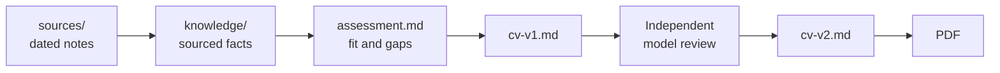
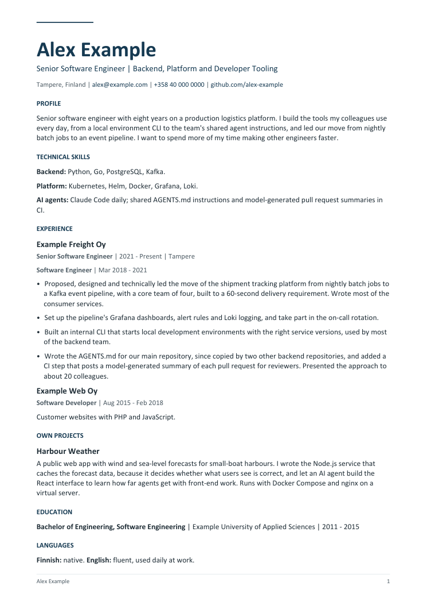

# Agent-first CV

[](https://github.com/eheikkinen/agent-first-cv/actions/workflows/check.yml)

A Git repository for writing job applications together with AI agents, where every claim in a CV can be traced back to its source.

I use a private version of this repository for my own job search. This public copy has the same structure, instructions and tooling, filled with a fictional engineer, **Alex Example**, so you can follow one application from the first interview to a reviewed, one-page PDF.

## Why

An AI agent writes a fluent CV in seconds. The hard part is keeping it true. Left alone, an agent turns "about 20 colleagues" into "the whole team", turns a requirement into a result and quietly adds an impressive number. The more context it has, the harder these are to spot.

This repository keeps the agent honest with a few plain rules:

- **Sources are append-only.** What the person says is saved as a dated note and never edited. A correction is a new note.
- **The knowledge base cites its sources.** Every group of facts links to the notes it came from, and estimates stay labelled as estimates.
- **CV versions are frozen.** Feedback produces `cv-v2.md`; `cv-v1.md` stays as it was.
- **A second model reviews the text blind.** It sees the CV and the boundaries, not the knowledge base, and its suggestions are not facts.

The rules live in [AGENTS.md](AGENTS.md), which both Claude Code (through [CLAUDE.md](CLAUDE.md)) and Codex read.

## How it works



## Follow the example

| Step | What to look at |
| --- | --- |
| 1. Interview | The person describes their career: [career interview](sources/2026-01-10-career-interview.md). |
| 2. Correction | A later answer fixes the team size and makes clear that 60 seconds was a requirement, not a measurement: [correction](sources/2026-01-12-correction-team-size-and-latency.md). The original note is untouched. |
| 3. Knowledge base | The facts, with sources and estimates labelled: [projects](knowledge/projects.md), [skills](knowledge/skills.md). |
| 4. Job posting | A fictional [Senior Platform Engineer posting](applications/2026-01-15-example-routes-senior-platform-engineer/job.md). |
| 5. Fit assessment | Requirements mapped to evidence, with the Terraform gap named instead of hidden: [assessment](applications/2026-01-15-example-routes-senior-platform-engineer/assessment.md). |
| 6. First draft | A typical first draft with typical problems: [CV v1](applications/2026-01-15-example-routes-senior-platform-engineer/cv-v1.md). |
| 7. Review | A real, unedited review by `claude-opus-5` run without tools: [review](applications/2026-01-15-example-routes-senior-platform-engineer/reviews/review-v1.md), and why each finding was accepted or rejected: [resolution](applications/2026-01-15-example-routes-senior-platform-engineer/reviews/resolution-summary.md). |
| 8. Second draft | [CV v2](applications/2026-01-15-example-routes-senior-platform-engineer/cv-v2.md), rendered below. |

<p align="center">
  
</p>

## Use it for your own job search

1. Copy the repository and keep your copy **private**. It will hold personal notes you do not want on the internet.
2. Delete the example content in `sources/`, `knowledge/` and `applications/`.
3. Open the folder in Claude Code or Codex and start talking: "I have worked at ... since ...". The agent saves what you say as sources and builds the knowledge base.
4. For each job, paste the posting and ask for a fit assessment first, then a CV.

## Structure

```text
sources/        Dated notes of what the person said; append-only
knowledge/      Current facts, each linked to its sources
applications/   One folder per job: posting, assessment, CV versions, reviews, tracking
templates/      PDF layout
scripts/        Link checker and PDF builder
tests/          Tests for the link checker
docs/           Workflow, independent reviews and PDF generation
AGENTS.md       Instructions for agents
```

Further reading: [workflow and maintenance](docs/workflow.md), [independent reviews](docs/independent-reviews.md), [PDF generation](docs/pdf-generation.md).

## Checks

Python 3.10+ and Git. The checker needs only the standard library; the PDF builder needs ReportLab.

```sh
python scripts/check_repo.py
python -m unittest discover -s tests
git diff --check
```

The checker verifies every relative Markdown link and heading anchor, and flags merge markers, encoding damage and machine-specific paths. It does not check whether a claim is true: that is what sources and reviews are for. CI runs the same checks on every push.

## Background

The layout follows Andrej Karpathy's [LLM Wiki](https://gist.github.com/karpathy/442a6bf555914893e9891c11519de94f) idea: raw sources, an LLM-maintained knowledge base and the instructions for maintaining it are kept apart. Markdown and Git are enough; no database or search service is needed.

## Licence

[MIT](LICENSE). Everything about Alex Example, including employers, the job posting and the numbers, is fictional.
