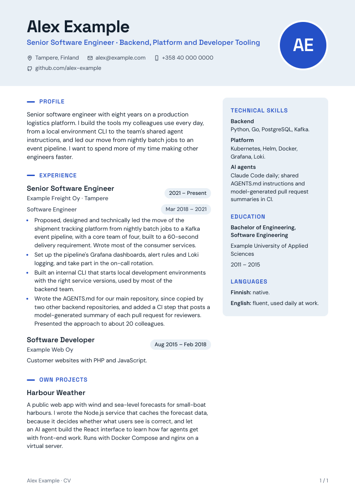

# PDF generation

A CV is written as Markdown and turned into a PDF locally. Text and layout stay separate, so a wording change never means fiddling with a word processor. Two builders read the same Markdown:

| Builder | Look | Needs |
| --- | --- | --- |
| [build_cv_band.py](../scripts/build_cv_band.py) | "Modern band": coloured header with a photo or initials, pill-shaped dates and a side panel for skills, education and languages. One or two pages. | Python 3.10+ standard library and any Chromium-based browser |
| [build_cv.py](../scripts/build_cv.py) | Classic single column, set by the [layout template](../templates/cv-style.json). | Python 3.10+ and ReportLab |

<p align="center">
  
  
</p>

## Modern band

```sh
python scripts/build_cv_band.py \
  applications/2026-01-15-example-routes-senior-platform-engineer/cv-v2.md \
  applications/2026-01-15-example-routes-senior-platform-engineer/output/cv-v2-band.pdf \
  --pages 1
```

- `--pages 2` (default) puts the profile and professional experience on page 1 in full width, and projects and earlier experience beside the side panel on page 2. `--pages 1` puts everything on one page, main column beside the side panel.
- `--photo me.png` shows a portrait in the header; without it the header shows the person's initials.
- The builder measures every page in the browser first. If the text does not fit, it stops and says by how many pixels, instead of clipping text or adding a page.
- The browser is found from `CHROME`, then from common names on `PATH` (`chromium`, `google-chrome`, `msedge`, ...), then from the usual install folders and Playwright's cache. Without a browser, install Chrome or Chromium, or run `npx playwright install chromium-headless-shell`.
- The only network request is the Google Fonts stylesheet (Space Grotesk and DM Sans). The CV text stays on the machine.

The section names it understands are `Profile`, `Experience` or `Professional experience`, `Own projects` or `Independent projects`, `Earlier experience`, `Technical skills`, `Education` and `Languages`. An unknown `##` section stops the build with a list of the known ones.

## Classic

Requires ReportLab (`pip install reportlab`).

```sh
python scripts/build_cv.py \
  applications/2026-01-15-example-routes-senior-platform-engineer/cv-v2.md \
  applications/2026-01-15-example-routes-senior-platform-engineer/output/cv-v2.pdf \
  --draft "Example Routes - Senior Platform Engineer"
```

`--draft LABEL` puts a draft mark and the label in the footer of every page. Leave it out for the version that will be sent.

The template uses the first font family whose files exist: Calibri on Windows, then Carlito (metric-compatible, `fonts-crosextra-carlito` on Debian and Ubuntu), then the Vera fonts bundled with ReportLab. Used glyphs are embedded in the PDF.

`output/` folders are ignored by Git; files that were actually sent are kept in `sent/`.

## Supported Markdown

A deliberately small subset, not a general Markdown renderer:

| Markdown | Becomes |
| --- | --- |
| `# Name` | Name at the top |
| `> Title` | Professional title under the name |
| Paragraphs before the first `##` | Contact lines; in Modern band, items separated by ` \| ` get icons |
| `## Section` | Section heading |
| `### Employer or project` | Entry heading |
| `**Title** \| dates` right after an entry | Role and dates line; several lines for several roles at one employer |
| `- item` | Bullet |
| `**bold**`, `[text](https://...)`, `mailto:` and `tel:` links | Inline formatting and links |
| `<!-- pagebreak -->` | Page break (classic only) |

## Checking the result

Look at every page as an image: line breaks, margins, page breaks and overlaps. Then check the text layer, for example with `pdftotext -layout`, because recruiting systems read the text, not the picture. Check that links point where they should and that the fonts are embedded (`pdffonts`).
