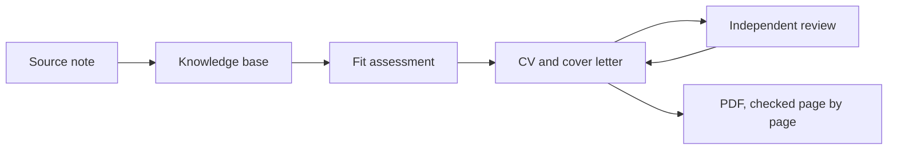

# Workflow and maintenance

## How information flows



Source notes keep what the user said and what outside material showed, exactly as it was when it was recorded. The knowledge base is the current interpretation of those sources. An application document picks the evidence that matters for one job; it never becomes a source itself.

## Layers

| Layer | Changes how | Written by |
| --- | --- | --- |
| `sources/` | Append only. A correction is a new dated note. | Agent, from what the user says or supplies |
| `knowledge/` | Updated in place, always linked to sources. | Agent, reviewed by the user |
| `applications/*/cv-vN.md` | Each delivered version is frozen; feedback creates the next one. | Agent, with user feedback |
| `applications/*/sent/` | Frozen copy of exactly what was sent. | Only after the user confirms sending |

## Handling a correction

1. Add a new source note that states the correction and links to the note it corrects.
2. Update the matching part of the knowledge base. Remove the open question it resolves, but keep limits that still apply.
3. Update any draft whose claims the correction affects.
4. Never edit the original source note or a document that has already been sent.

Several notes from the same day can be follow-ups to one conversation. The date alone does not order them: a correction says which earlier information it replaces.

## Precision of numbers and responsibilities

- Tell apart the user's estimate, use the user has confirmed, an implementation seen in a repository and a check that was actually run.
- Keep a requirement apart from a measured result. "Must respond within 300 ms" is a requirement, not an average latency.
- Keep the date and the denominator of every estimate. "About 40 pull requests" means little without the period and what was counted.
- Mark figures that describe the present, such as user counts, to be rechecked when an application is written.

## Checks and commits

```sh
python scripts/check_repo.py
python -m unittest discover -s tests
git diff --check
```

Also read the diff for content: claims match their sources, internal names are generalised and only the intended change is included. Stage files by name. Make one commit per coherent topic.
